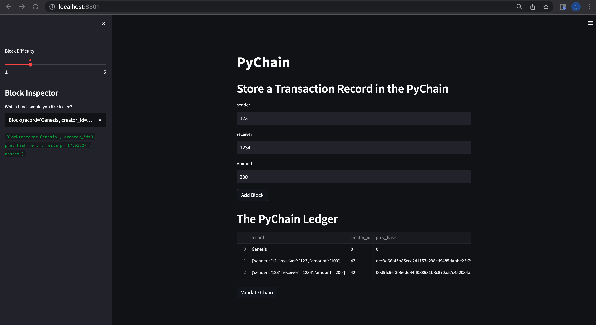
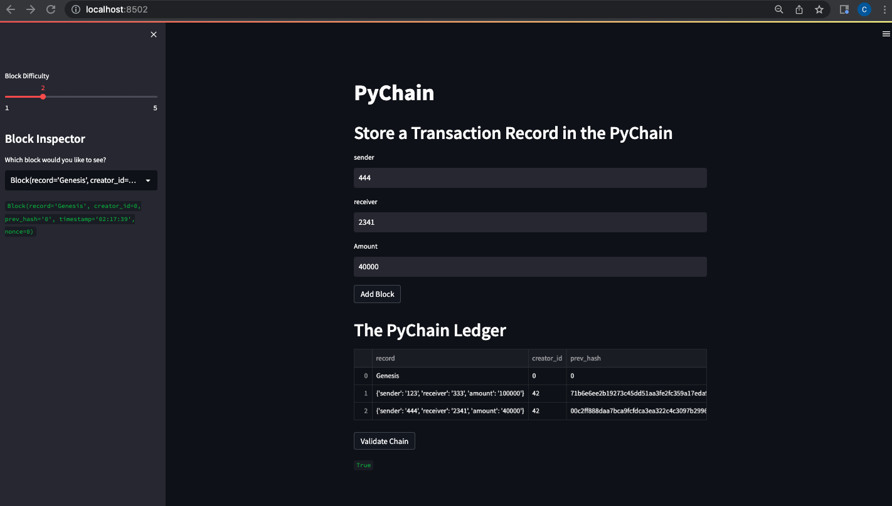

# Module_18_Challenge
Building a Blockchain-based Ledger System with python.


---

## Technologies
Streamlit - Python library for building web interfaces for your Python applications.


## Installation Guide

Make sure streamlit is installed in your dev environment

```
pip install streamlit
```
---

## Usage

To use this, navigate to the terminal where pychain.py is located, and run the following: 
```
streamlit run pychain.py
```
* Once you enter the sender, receiver, and amount you can see that it is added to the chain. See the images below:
----




----

## Contributors

G. Cale McDowell

@gcm107
---

## License